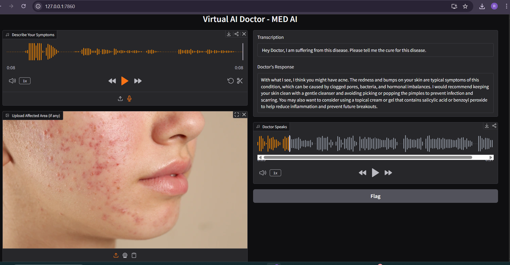

# 🩺 MED-AI – AI Virtual Doctor

MED-AI is an AI-powered healthcare assistant that analyzes medical images and voice symptoms to provide educational health insights. It combines multimodal AI, speech recognition, and text-to-speech to create an interactive virtual doctor experience.

## ✨ Features

- 🖼️ Medical image analysis
- 🎤 Voice symptom input
- 🤖 AI-powered medical responses
- 🔊 Natural voice replies
- 🌐 Interactive Gradio web interface

## 🛠️ Technologies Used

- Python
- Gradio
- Groq API
- Llama 4 Scout Vision
- Whisper Large v3
- ElevenLabs
- gTTS

## 🚀 Live Demo

**Hugging Face Space:**  
https://huggingface.co/spaces/irshadsyed/MED-AI

## 📸 Preview

## ⚠️ Disclaimer

This project is developed for educational and learning purposes only. It is not intended to replace professional medical advice, diagnosis, or treatment.